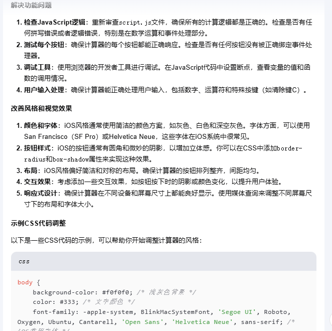
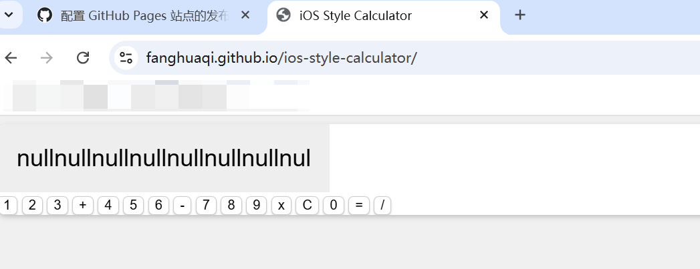

# Thinking Kimi

主要参考如下文章 [17岁高中生写了个神级Prompt，直接把Claude强化成了满血o1。](https://mp.weixin.qq.com/s?__biz=MzIyMzA5NjEyMA==&mid=2647666595&idx=1&sn=cc11f5efe1d9fe3cc49ef5fe1cb5afa5&chksm=f1e61ab515d2643e7ad16adb82b707f4d24a3f5b84a08c8a4e559bcc078d864d88f19abc4d13&mpshare=1&scene=1&srcid=11147w44je7kuIV7cusOzpG5&sharer_shareinfo=a4b427cc18cfb192d0df9b12e0c49324&sharer_shareinfo_first=a4b427cc18cfb192d0df9b12e0c49324&from=industrynews&version=4.1.30.6008&platform=win&nwr_flag=1#wechat_redirect)，但是我没有办法访问Claude，但是我想了下我可以使用国内我认为最强的Kimi Chat来做这件事情。

怎么做呢，先简单的把里面`anthropic` 替换成 `moonshoot`, 然后把 `Claude`替换成`Kimi`, 可以用vscode不区分大小写替换。

替换完毕后，开始参考**最简单的计算器**实施起来。

先把这个[**Kimi Protocol**](kimi_instructions.md)丢给Kimi，Kimi如下响应：

> 看着还真是有模有样。

然后我给他丢一个Prompt: `我想做一个计算器，给我做出来吧`

这点和Claude表现基本一致，可以看到Kimi有明显的思维过程，在考虑不同的应用场景，最后选了一个python来实现简单的计算器。

但是我这里实际像做一个IOS 风格的计算器，我这里再给出 Prompt : `我想做一个网页版的计算器，具备类似IOS风格`

可以看到上面网页已经明显做出来了，虽然不知道准确度如何，我想体验下，但是不知道怎么部署。我又丢了一个 Prompt `我怎么样部署他呢，给我一些步骤`

可以看到Kimi给出来详细的部署建议了，有**Github Pages**，**Netlify**和 **Vercel**建议，
我对Github熟一些，可以让他教我部署，我又写了Prompt: `那我就部署到github pages吧，请给我一步步列出来，别忘了前面的代码分别应该取什么名字`, 
然后他就真的一步步教我怎么创建仓库和准备代码了。

先创建一个仓库 [GitHub - fanghuaqi/ios-style-calculator: iOS-style calculator by Kimi Protocol.](https://github.com/fanghuaqi/ios-style-calculator)

本地我创建了一个文件夹 `ios-style-calculator`

~~~shell
cd ios-style-calculator
git remote add origin git@github.com:fanghuaqi/ios-style-calculator.git
git fetch
git checkout main
# 创建几个空文件
touch index.html styles.css script.js
# 然后这里把前面kimi输出的几个文件内容，分别填充到里面去
# 然后把代码提交进去
git add .
# 撰写提交记录
git commit -s
# 推送到github仓库
git push origin main
~~~

然后点击仓库的`Settings`,设置Github Pages部署页面源为`main`分支代码

后面发现网页并没有上线 https://fanghuaqi.github.io/ios-style-calculator

后面想到Github Pages部署静态站点的时候，如果不是 `Jekyll`构建的网页，
需要加上 `.nojekyll`文件，参见 
[配置 GitHub Pages 站点的发布源 - GitHub 文档](https://docs.github.com/zh/pages/getting-started-with-github-pages/configuring-a-publishing-source-for-your-github-pages-site)。

~~~shell
# 添加 .nojekyll 文件
touch .nojekyll
git add .nojekyll
# 填写提交记录
git commit -s
# push到仓库上
git push origin main
~~~

后面在仓库网页上看到，Github CI开始构建pages了

然后网页也确实上线了，如下，**但是功能貌似不太对**。

准备反馈下给Kimi，让他修正下。

Prompt: `发现需要创建一个 .nojekyll 文件，就可以部署到github pages上了，网页可以正常显示了，但是功能不太对，且风格太简谱了`

Kimi给出来了一些修改建议，但是只修改了CSS，我先把CSS的修改先提交上去吧。

注意下，网页部署需要几分钟，等待下后**强制刷新网页**  `Ctrl+F5`  发现网页非常不正常了

然后做了如下几个Prompt

~~~
我需要你帮我检查错误，并修复他
代码文件怎么上传？
这个是做一个网页版IOS风格计算器，但是网页排版有错误，且功能也是错误的，请解决
~~~

按照他的修改建议修改了下代码，部署后强制刷新，代码效果如下

可以看到这里的布局已经乱了，然后继续Prompt修正 `按照更新的代码，部署后，发现布局好了一些，但是还是错误的，需要修正下，功能也没法测试

按照新的修正提交后, 刷新网页，更新代码效果如下，布局对了，功能貌似也是对的，但是输入框显示有位移偏差

继续Prompt `网页布局显示正常了，但是输入框有部分没有显示出来，请修正`

按照上面提示修正代码后，如下效果如下，这回功能都正常了，**Great!**

